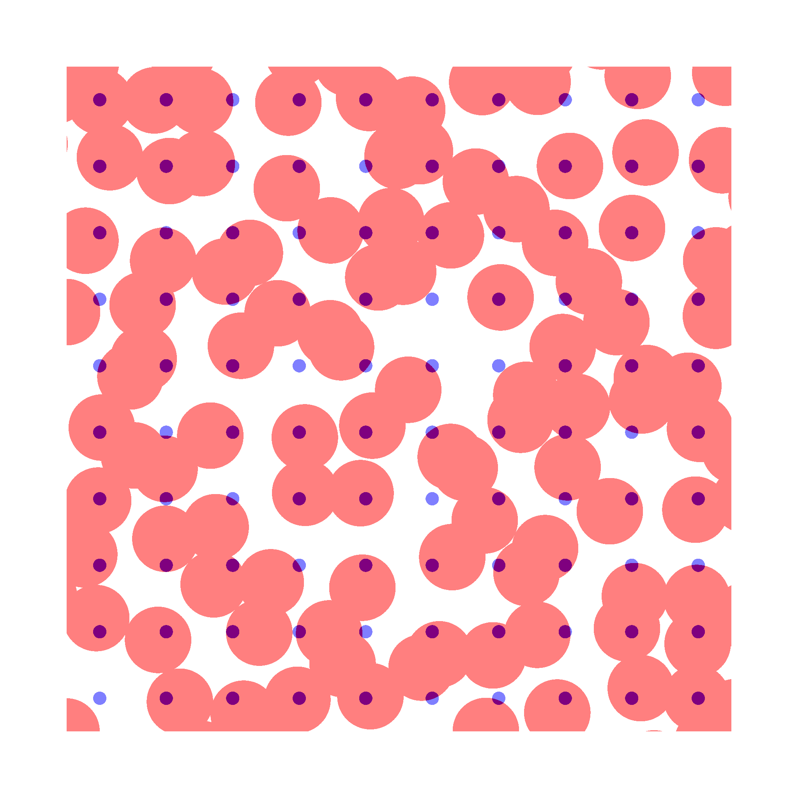
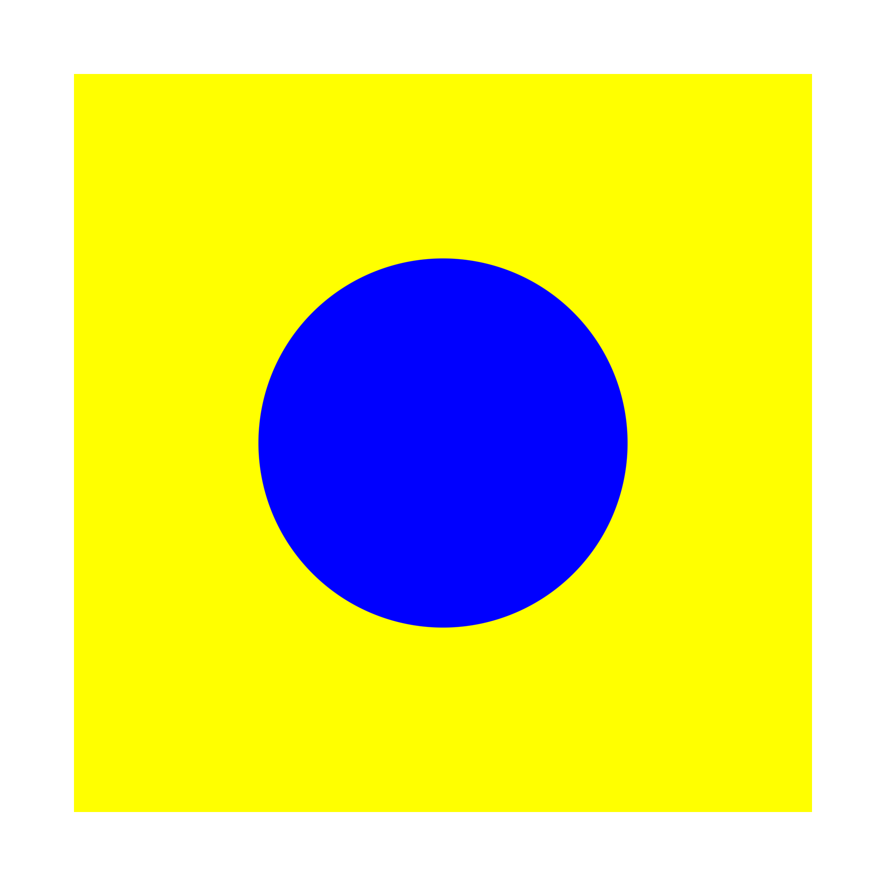

# glsl-simple-alpha-compositing

GLSL implementation of the simple alpha compositing function, as described in the [W3C Editor's draft](https://drafts.fxtf.org/compositing-1/#simplealphacompositing) in Compositing and Blending.

## Install

```sh
npm install glsl-simple-alpha-compositing
```

## Usage

```glsl
#pragma glslify: simpleAlphaCompositing = require(glsl-simple-alpha-compositing);

vec4 source = vec4(1., 0., 0., .5);
vec4 backdrop = vec4(0., 1., 0., .3);

vec3 color = simpleAlphaCompositing(source, backdrop);
```



## An example: set the background color in a GLSL fragment shader.

The simple alpha compositing can be used to set the background colour in a glsl fragment shader.

The following code uses the `step` function to set the alpha channel value to 1 for all the points which distance from the circle centre is less than 0.25, otherwise, the alpha channel is set to 0.

The `simpleAlphaCompositing` function is used to compose the blue circle with a yellow background.

```
vec3 circleField (vec2 p) {
	// Colors
	vec3 circleColor = vec3(0., 0., 1.); // blue
	vec3 backgroundColor = vec3(1., 1., 0.); // yellow

	// Background field
	vec4 background = vec4(backgroundColor, 1.);

	// Foreground field, a circle.
	vec2 center = vec2(.5);
	float d = distance(p, center);
	float delta = 0.0005;
	// Note that the circular shape is implemented in the alpha channel.
	vec4 circle = vec4(circleColor, smoothstep(d - delta, d + delta, 0.25));

	return simpleAlphaCompositing(circle, background);
}

void main() {
	vec3 color = circleField(vUv);
	gl_FragColor = vec4(color, 1.0);
}
```


